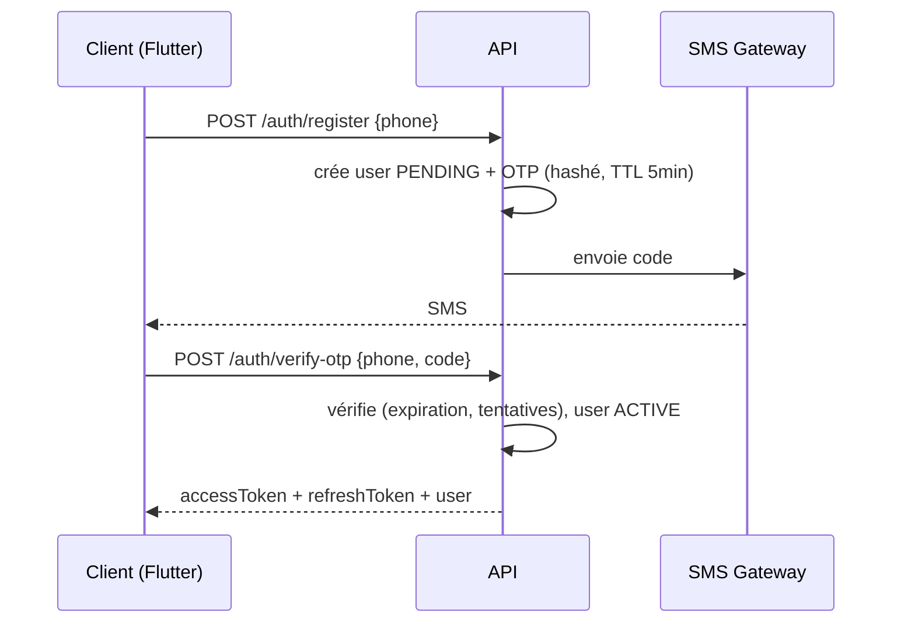
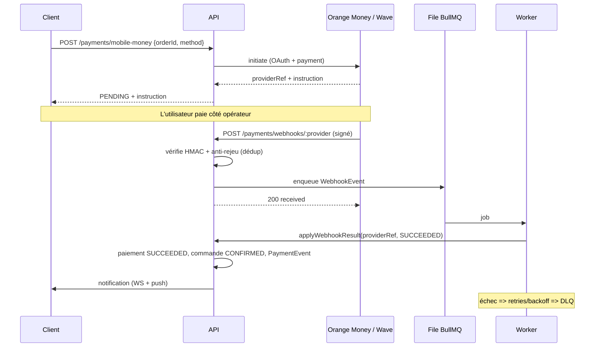
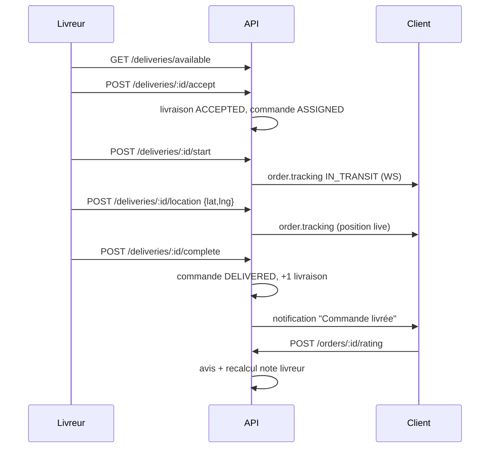
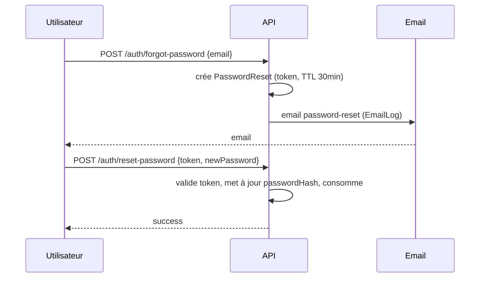

# NOVIGO — Diagrammes de séquence

## 1. Inscription OTP

```mermaid
sequenceDiagram
    participant C as Client (Flutter)
    participant A as API
    participant S as SMS Gateway
    C->>A: POST /auth/register {phone}
    A->>A: crée user PENDING + OTP (hashé, TTL 5min)
    A->>S: envoie code
    S-->>C: SMS
    C->>A: POST /auth/verify-otp {phone, code}
    A->>A: vérifie (expiration, tentatives), user ACTIVE
    A-->>C: accessToken + refreshToken + user
```

## 2. Paiement Mobile Money + webhook robuste

```mermaid
sequenceDiagram
    participant C as Client
    participant A as API
    participant P as Orange Money / Wave
    participant Q as File BullMQ
    participant W as Worker
    C->>A: POST /payments/mobile-money {orderId, method}
    A->>P: initiate (OAuth + payment)
    P-->>A: providerRef + instruction
    A-->>C: PENDING + instruction
    Note over C,P: L'utilisateur paie côté opérateur
    P->>A: POST /payments/webhooks/:provider (signé)
    A->>A: vérifie HMAC + anti-rejeu (dédup)
    A->>Q: enqueue WebhookEvent
    A-->>P: 200 received
    Q->>W: job
    W->>A: applyWebhookResult(providerRef, SUCCEEDED)
    A->>A: paiement SUCCEEDED, commande CONFIRMED, PaymentEvent
    A->>C: notification (WS + push)
    Note over W: échec => retries/backoff => DLQ
```

## 3. Cycle de vie d'une livraison

```mermaid
sequenceDiagram
    participant D as Livreur
    participant A as API
    participant Cl as Client
    D->>A: GET /deliveries/available
    D->>A: POST /deliveries/:id/accept
    A->>A: livraison ACCEPTED, commande ASSIGNED
    D->>A: POST /deliveries/:id/start
    A->>Cl: order.tracking IN_TRANSIT (WS)
    D->>A: POST /deliveries/:id/location {lat,lng}
    A->>Cl: order.tracking (position live)
    D->>A: POST /deliveries/:id/complete
    A->>A: commande DELIVERED, +1 livraison
    A->>Cl: notification "Commande livrée"
    Cl->>A: POST /orders/:id/rating
    A->>A: avis + recalcul note livreur
```

## 4. Réinitialisation du mot de passe

```mermaid
sequenceDiagram
    participant U as Utilisateur
    participant A as API
    participant E as Email
    U->>A: POST /auth/forgot-password {email}
    A->>A: crée PasswordReset (token, TTL 30min)
    A->>E: email password-reset (EmailLog)
    E-->>U: email
    U->>A: POST /auth/reset-password {token, newPassword}
    A->>A: valide token, met à jour passwordHash, consomme
    A-->>U: success
```
